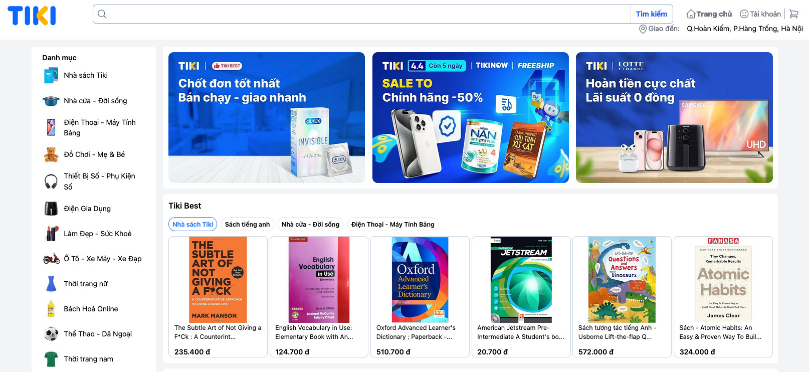

# Tiki Ecommerce Clone 🐦

Welcome to the Tiki Ecommerce Clone project! This README will provide you with all the necessary information to understand, set up, and run the project.

## Project Overview  📌

The Tiki Ecommerce Clone is a fully functional ecommerce web application inspired by [Tiki.com](https://tiki.vn/). This project showcases a modern web development stack including ReactJS for the frontend, Strapi for the backend, and PostgreSQL for the database. Additionally, the project is containerized with Docker and served using Nginx.

## Key Features 👀

The Tiki Ecommerce Clone provides several core features of the original Tiki.com website, including:

- **Browsing Products**: Users can view and search for products across various categories.
- **Shopping Cart**: Users can add products to their cart and manage quantities.
- **Order Placement**: Users can place orders for products in their cart.
- **User Information Management**: Users can manage their personal information and preferences.
- **Order History**: Users can view their past orders and order details.

## Demo ☁️
[Click here to watch the demo](./images/demo.mp4)

## Future Improvements 👨🏻‍🏭
While this project provides a decent level of functionality, it is still a work in progress and not yet ready for widespread production use. Here are some planned improvements:
- Enhanced security features
- Improved user interface and experience
- More robust error handling and logging
- Additional ecommerce features such as payment gateway integration and product reviews

## Technology Stack 👨🏻‍💻

### Frontend

- **ReactJS**: A JavaScript library for building user interfaces.

### Backend

- **Strapi**: A flexible and customizable headless CMS.
- **PostgreSQL**: A powerful, open-source object-relational database system.

### Deployment

- **Docker**: Containerization for easy deployment and scalability.
- **Nginx**: A high-performance web server used for serving the frontend and acting as a reverse proxy to the backend.
##

    
    
    
    
    
    
    
    
    
    
    
    
    
    

## License

This project is licensed under the [MIT License](LICENSE).
